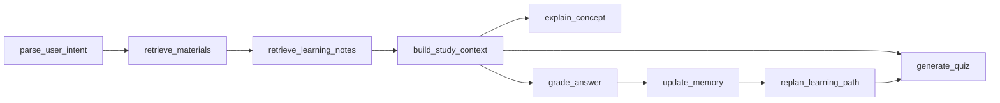

# StudyLoop

StudyLoop is a local-first AI study assistant built on FastAPI, LangGraph, and the HelloAgents framework. It can ingest learning materials, retrieve relevant evidence, explain concepts, generate practice questions, grade answers, update mastery scores, and save mistake records for later review.

The project is designed for interview preparation and structured self-study: you give it notes or study material, then StudyLoop turns them into an interactive learning loop.

## Features

- Knowledge ingestion from manual text or a local Obsidian vault
- Evidence-grounded explanations based on retrieved study material
- Quiz generation with topic, difficulty, count, and question type controls
- Answer grading with feedback, mistake type, suggested notes, and mastery updates
- Remediation loop powered by LangGraph when mastery is below the threshold
- Persistent learning notes and study history stored locally
- Mock LLM mode for local development without an API key
- Optional OpenAI-compatible model configuration
- FastAPI backend plus Vue-based frontend workspace
- MCP endpoint for exposing study tools to compatible clients

## Tech Stack

- Backend: Python 3.10+, FastAPI, Pydantic, LangGraph
- Agent framework: HelloAgents
- Frontend: Vue 2, Vue CLI
- Storage: local Markdown/JSON notes and SQLite study history
- Retrieval: in-memory keyword retrieval by default, with reserved Qdrant/vector configuration hooks

## Project Structure

```text
.
|-- backend/
|   `-- app/
|       |-- agents/          # LangGraph graph and node functions
|       |-- schemas/         # Pydantic state and response models
|       |-- services/        # retrieval, notes, mastery, study service
|       |-- static/          # fallback static frontend
|       |-- config.py        # environment settings
|       |-- main.py          # FastAPI entrypoint
|       `-- mcp_server.py    # MCP tool server
|-- frontend/                # Vue frontend
|-- hello_agents/            # underlying agent framework
|-- scripts/                 # import and acceptance scripts
|-- tests/                   # backend and graph tests
|-- requirements.txt
`-- pyproject.toml
```

## Quick Start

Create and activate a virtual environment:

```bash
python -m venv .venv
source .venv/Scripts/activate
```

On PowerShell, use:

```powershell
python -m venv .venv
.\.venv\Scripts\Activate.ps1
```

Install backend dependencies:

```bash
pip install -r requirements.txt
```

Start the backend:

```bash
uvicorn backend.app.main:app --reload --port 8765
```

Open:

```text
http://localhost:8765
```

Health check:

```text
http://localhost:8765/health
```

API docs:

```text
http://localhost:8765/docs
```

## Environment Variables

The backend loads `.env` from the project root. You can start without a `.env`; when no API key is configured, StudyLoop automatically uses mock mode.

Create `.env` when you want to use a real model:

```bash
OPENAI_API_KEY=your_api_key
OPENAI_BASE_URL=https://api.openai.com/v1
OPENAI_MODEL=gpt-4o-mini
USE_MOCK_LLM=false
```

For local testing without model calls:

```bash
USE_MOCK_LLM=true
```

Compatible aliases are also supported:

```bash
LLM_API_KEY=your_api_key
LLM_BASE_URL=https://api.openai.com/v1
LLM_MODEL_ID=gpt-4o-mini
```

Optional vector retrieval settings:

```bash
QDRANT_URL=
QDRANT_API_KEY=
QDRANT_COLLECTION=hello_agents_vectors
EMBED_API_KEY=
EMBED_BASE_URL=https://api.openai.com/v1
EMBED_MODEL_NAME=text-embedding-3-small
```

## Frontend Development

The backend can serve the built frontend from `frontend/dist`. For frontend development:

```bash
cd frontend
npm install
npm run serve
```

The Vue dev server runs on `http://localhost:8080` by default and calls the backend API.

Build production assets:

```bash
cd frontend
npm run build
```

Then restart the backend and visit `http://localhost:8765`.

## Core API

### Ingest Knowledge

```http
POST /knowledge/ingest
```

Example body:

```json
{
  "content": "InnoDB uses B+ tree indexes. A secondary index stores the index key and primary key.",
  "source": "manual",
  "title": "InnoDB Index Notes",
  "topic": "MySQL"
}
```

### Import Obsidian Vault

```http
POST /knowledge/import-obsidian
```

Example body:

```json
{
  "vault_path": "D:/Notes/MyVault",
  "include_subdirs": ["Database", "Interview"],
  "max_files": 200,
  "dry_run": false
}
```

### Explain a Concept

```http
POST /study/explain
```

```json
{
  "question": "Why can database indexes improve query performance?",
  "current_topic": "MySQL"
}
```

### Generate a Quiz

```http
POST /study/quiz
```

```json
{
  "current_topic": "MySQL",
  "difficulty": "medium",
  "question_count": 3,
  "question_types": ["multiple_choice", "open_ended"]
}
```

### Grade an Answer

```http
POST /study/grade
```

```json
{
  "question": "What is a covering index?",
  "student_answer": "It means the query can get all required columns from the index itself.",
  "current_topic": "MySQL"
}
```

### Other Useful Endpoints

- `GET /health` checks service status and current LLM mode
- `GET /study/state` returns indexed documents, note stats, mastery, and retrieval backend
- `GET /study/topics` returns the topic catalog and recommended topic
- `GET /notes` lists or searches saved notes
- `POST /chat` runs a free-form study chat
- `POST /study/session/start` starts an interactive quiz session
- `POST /study/session/resume` resumes the session with a student answer
- `POST /study/exam/submit` grades a batch of exam questions

## LangGraph Study Loop

StudyLoop routes the main learning flow through a graph:



The graph builds a structured study context with role instructions, learning goal, current task, learner state, retrieved evidence, mistake history, learning notes, conversation context, and output requirements.

## Testing

Run the test suite:

```bash
pytest
```

Run a focused set:

```bash
pytest tests/test_study_loop_graph.py tests/test_api_graph.py
```

The project is designed so tests can run in mock mode without a real LLM key.

## GitHub Setup

This repository is intended to be pushed to:

```text
https://github.com/Qtte/studyloop.git
```

Typical first push:

```bash
git add .
git commit -m "Initial commit"
git branch -M main
git remote add origin https://github.com/Qtte/studyloop.git
git push -u origin main
```

If `origin` already exists:

```bash
git remote set-url origin https://github.com/Qtte/studyloop.git
git push -u origin main
```

## License

This project currently keeps the upstream `LICENSE` file from HelloAgents. Review the license before using the project commercially.
