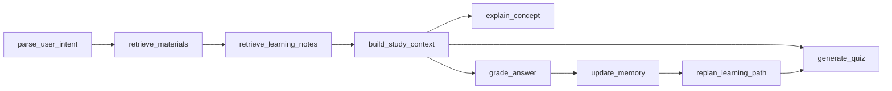

# StudyLoop

StudyLoop 是一个本地优先的 AI 学习助手，基于 FastAPI、LangGraph 和 HelloAgents 构建。它可以导入学习资料，检索相关证据，讲解概念，生成练习题，批改答案，更新掌握度，并把错题记录保存下来，方便后续复习。

这个项目适合用来做面试复习、知识库学习和结构化自测：你先把笔记或资料交给系统，StudyLoop 会围绕这些资料形成一个「讲解 - 出题 - 批改 - 记录 - 再规划」的学习闭环。

## 功能特性

- 支持手动文本导入和本地 Obsidian 知识库批量导入
- 基于检索证据生成概念讲解，减少空泛回答
- 支持按主题、难度、题型和数量生成练习题
- 支持答案批改、错误类型分析、反馈建议和掌握度更新
- 当掌握度低于阈值时，通过 LangGraph 自动触发补练流程
- 本地持久化学习笔记、错题记录和学习历史
- 没有 API Key 时自动进入 Mock LLM 模式，方便本地开发和测试
- 支持 OpenAI 兼容接口配置，可接入不同模型服务
- 提供 FastAPI 后端和 Vue 前端工作台
- 提供 MCP 工具接口，方便接入兼容客户端

## 技术栈

- 后端：Python 3.10+、FastAPI、Pydantic、LangGraph
- Agent 框架：HelloAgents
- 前端：Vue 2、Vue CLI
- 存储：本地 Markdown/JSON 笔记和 SQLite 学习历史
- 检索：默认使用内存关键词检索，预留 Qdrant/向量检索配置

## 项目结构

```text
.
|-- backend/
|   `-- app/
|       |-- agents/          # LangGraph 图和节点函数
|       |-- schemas/         # Pydantic 状态和响应模型
|       |-- services/        # 检索、笔记、掌握度、学习服务
|       |-- static/          # 后端自带的静态页面
|       |-- config.py        # 环境变量配置
|       |-- main.py          # FastAPI 入口
|       `-- mcp_server.py    # MCP 工具服务
|-- frontend/                # Vue 前端
|-- hello_agents/            # 底层 Agent 框架
|-- scripts/                 # 导入脚本和验收脚本
|-- tests/                   # 后端和图流程测试
|-- requirements.txt
`-- pyproject.toml
```

## 快速开始

创建并激活虚拟环境：

```bash
python -m venv .venv
source .venv/Scripts/activate
```

如果你使用 PowerShell：

```powershell
python -m venv .venv
.\.venv\Scripts\Activate.ps1
```

安装后端依赖：

```bash
pip install -r requirements.txt
```

启动后端：

```bash
uvicorn backend.app.main:app --reload --port 8765
```

打开应用：

```text
http://localhost:8765
```

健康检查：

```text
http://localhost:8765/health
```

接口文档：

```text
http://localhost:8765/docs
```

## 环境变量

后端会从项目根目录读取 `.env`。如果没有配置 API Key，StudyLoop 会自动使用 Mock LLM 模式，因此可以直接本地运行和测试。

如果要接入真实模型，可以创建 `.env`：

```bash
OPENAI_API_KEY=your_api_key
OPENAI_BASE_URL=https://api.openai.com/v1
OPENAI_MODEL=gpt-4o-mini
USE_MOCK_LLM=false
```

如果只想本地测试，不调用模型：

```bash
USE_MOCK_LLM=true
```

也支持下面这些兼容变量名：

```bash
LLM_API_KEY=your_api_key
LLM_BASE_URL=https://api.openai.com/v1
LLM_MODEL_ID=gpt-4o-mini
```

可选的向量检索配置：

```bash
QDRANT_URL=
QDRANT_API_KEY=
QDRANT_COLLECTION=hello_agents_vectors
EMBED_API_KEY=
EMBED_BASE_URL=https://api.openai.com/v1
EMBED_MODEL_NAME=text-embedding-3-small
```

## 前端开发

后端会优先服务 `frontend/dist` 中的构建产物。开发前端时可以进入 `frontend` 目录：

```bash
cd frontend
npm install
npm run serve
```

Vue 开发服务默认运行在：

```text
http://localhost:8080
```

构建生产版本：

```bash
cd frontend
npm run build
```

构建后重启后端，再访问 `http://localhost:8765` 即可看到前端页面。

## 核心接口

### 导入学习资料

```http
POST /knowledge/ingest
```

示例请求：

```json
{
  "content": "InnoDB 使用 B+ 树索引。二级索引保存索引列值和主键值。",
  "source": "manual",
  "title": "InnoDB 索引笔记",
  "topic": "MySQL"
}
```

### 导入 Obsidian 知识库

```http
POST /knowledge/import-obsidian
```

示例请求：

```json
{
  "vault_path": "D:/Notes/MyVault",
  "include_subdirs": ["Database", "Interview"],
  "max_files": 200,
  "dry_run": false
}
```

### 讲解概念

```http
POST /study/explain
```

```json
{
  "question": "为什么数据库索引可以提升查询性能？",
  "current_topic": "MySQL"
}
```

### 生成练习题

```http
POST /study/quiz
```

```json
{
  "current_topic": "MySQL",
  "difficulty": "medium",
  "question_count": 3,
  "question_types": ["multiple_choice", "open_ended"]
}
```

### 批改答案

```http
POST /study/grade
```

```json
{
  "question": "什么是覆盖索引？",
  "student_answer": "查询需要的字段都能直接从索引中获得，不需要回表。",
  "current_topic": "MySQL"
}
```

### 其他常用接口

- `GET /health`：检查服务状态和当前 LLM 模式
- `GET /study/state`：查看文档索引数量、笔记统计、掌握度和检索后端
- `GET /study/topics`：查看主题目录和推荐复习主题
- `GET /notes`：列出或搜索学习笔记
- `POST /chat`：进行自由学习对话
- `POST /study/session/start`：启动交互式练习会话
- `POST /study/session/resume`：提交答案并恢复会话
- `POST /study/exam/submit`：批量提交并批改一套题

## LangGraph 学习闭环

StudyLoop 的主要学习流程由 LangGraph 编排：



图流程会构建一个结构化学习上下文，包含角色约束、学习目标、当前任务、学习者状态、检索证据、错题历史、学习笔记、对话上下文和输出要求。

## 测试

运行完整测试：

```bash
pytest
```

运行重点测试：

```bash
pytest tests/test_study_loop_graph.py tests/test_api_graph.py
```

测试默认可以在 Mock LLM 模式下运行，不需要真实模型 Key。

## GitHub 上传

远程仓库地址：

```text
https://github.com/Qtte/studyloop.git
```

常用提交和推送命令：

```bash
git add README.md .gitignore
git commit -m "Update Chinese README"
git push -u origin main
```

如果远程仓库已有初始化内容，需要先同步：

```bash
git pull --rebase origin main --allow-unrelated-histories
git push -u origin main
```

## License

本项目当前保留了上游 HelloAgents 的 `LICENSE` 文件。商业使用前请先检查许可证限制。
